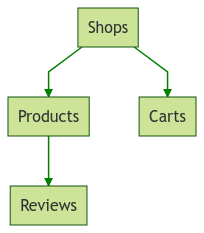

# vontex

> :herb: Vuex + Contextual entity modules

---

Vuex is a super awesome state management library for Vue.

But one major limitation I frequently run into is the linear and singleton nature of the stores.

This limitation makes it very difficult to manage a tree of entity states, at least without resorting to non-idiomatic solutions such as dynamic modules.

Vontex alleviates this problem by creating a pragmatic wrapper API based on `registerModule` and `unregisterModule`, such that you don't have to call these methods yourself or deal with the extra complexity that comes from self-managing dynamic modules.

> :warning: This library is experimental and under heavy development!

## Problem

Say you are creating an e-commerce application with the following domain:



With traditional Vuex, you would likely establish the following module namespaces:

 - `shops`
 - `shops/products`
 - `shops/carts`
 - `shops/products/reviews`

This means that `products`, `carts`, and `reviews` will all be fixed to the linear context of their parent modules.

In other words, if you are trying to track which `shop` is selected by the user, and thus which `products` are available and selected within that `shop` and so on, you likely have a problem.

Once the current/selected `shop` is changed, all of its sub-modules must be re-selected as well, and all history of their previous states is lost due to the linear nature of Vuex.

This leads to redundant network traffic, limits the reusability of your components, forces users to unnecessarily lose their changes in forms, and many other complications.

## Solution

Vontex automagically creates and manages dynamic modules associated with your entity instance states.

Each entity module tracks `all` of its instances and its current `selected` instance (i.e., its **context**).

The selected instance `id` for each entity replaces the wildcard value (`*`) that's provided in the Vontex store namespace in your mapping helpers.

Applied to the example domain described in the following example, you might have the following `Shop.vue` component:

```vue
<template>
  <h1>{{ shop }}</h1>
  <p style="text-align: right">
    {{ productCount }} products
  </p>
  <ul>
    <li v-for="product in products">
      {{ product.name }} - <a @click="purchase">Buy</a>
    </li>
  </ul>
</template>

<script>
export default {
  context: ({ mapState, mapActions }) => {
    computed: {
      ...mapState('shop', {
        shop: 'selected'
      }),

      ...mapState('shop/*/product', {
        products: 'all',
        productCount: state => state.all.length
      })
    },

    methods: {
      ...mapActions('shop/*/product', ['buy'])
    }
  }
}
</script>
```

Instead of using the `*` wildcard, you could also just provide the explicit `id` of the `shop` to map your component's state to (e.g. `shop/123/product`).

This makes it incredibly easy to have components that are synchronized with the selected/contextual entity, or to have components which are tied to an explicit entity that doesn't necessarily pertain to the user's selected context.

This gives you the best of both worlds, especially since you can use Vontex alongside vanilla Vuex as you wish.

### Alternatives

Service Workers can solve many of these problems, but you will likely still have to write a bunch of management logic around the Cache interface that can be just as difficult to wrangle depending on your needs.

Service Workers can and should be used as a complementary solution to Vontex. I will write up a detailed guide on how these technologies can be combined in the future.

## Install

```sh
npm i slurmulon/vontex
```

When used with a module system, you must explicitly install Vontex via `Vue.use`:

```js
import Vue from 'vue'
import Vontex from 'vontex'

Vue.use(Vontex)
```

## Roadmap

 - [ ] Documentation
 - [ ] Guide

## License

MIT
